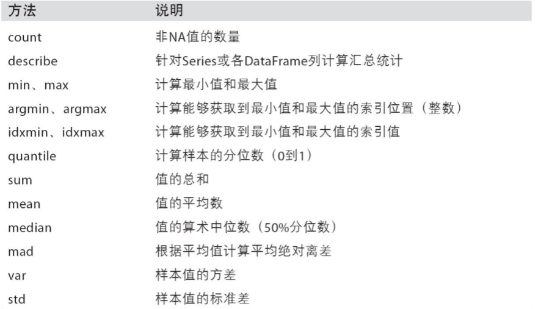
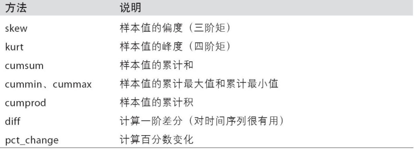

# 空气质量指数计算
## 案例描述
- 空气质量指数计算方法
	- 空气质量分指数individual air qualityindex (IAQI)：单项污染物的空气质量指数
- 空气质量分指数计算方法
	- 空气质量指数airquality index (AQI)：定量描述空气质量状况的无量纲指数
	
- 2.0 
	- 读取已经获取的JSON数据文件
	- 并将AQI前5的数据输出到文件
- 3.0 
	- 读取已经获取的JSON数据文件
	- 并将其转换成CSV文件
- 4.0 
	- 根据输入的文件判断是JSON格式还是CSV格式，并进行相应的操作
- 5.0 
	- 为了能有效地提取并利用网络信息并工作提高效率，出现了网络爬虫
	- 利用网络爬虫实时获取城市的空气质量
- 6.0
	- 高效地解析和处理HTML，beautifulsoup4
- 7.0
	- 利用beautifulsoup4获取所有城市的空气质量
- 8.0 
	- 将获取的所有城市空气质量保存成CSV数据文件
- 9.0
	- 利用Pandas进行数据处理分析
- 10.0
	- 数据清洗；利用Pandas进行数据可视化
	
	
## 案例分析
- 举例：PM2.5的测量值为55

- 实现步骤：
	1. 实现每种污染物对应的IAQI函数
		- 1个输入参数，即C p
	2. 实现线性缩放函数
		- 5个输入参数

	7.0
	1. 首先获取所有的城市列表，及对应的url
	2. 根据url获取城市的空气质量（6.0程序）
	
## JSON格式
- JSON(JavaScript Object Notation)是一种轻量级数据交换格式
- 可以对复杂数据进行表达和存储，易于阅读和理解
- 规则
	1. 数据保存在键值对中
	2. 键值对之间由逗号分隔
	3. 花括号用于保存键值对数据组成的对象
	4. 方括号用于保存键值对数据组成的数组
- 采用对象、数组方式组织起来的键值对可以表示任何结构的数据
- JSON格式是互联网上主要使用的复杂数据格式之一

## JSON库
- JSON库是处理JSON格式的Python标准库
- 两个过程：
	- 编码(encoding)，将Python数据类型转换成JSON格式的过程
	- 解码(decoding)，从JSON格式中解析数据对应到Python数据类型的过程

函数 |含义
------|------
dumps() |将Python数据类型转换为JSON格式
loads() |将JSON格式字符串转换为Python数据类型
dump() |与dumps()功能一致，输出到文件
load() |与loads()功能一致，从文件读入

## 列表排序
- list.sort(func)

		func指定了排序的方法
- func可以通过lambda函数实现

## CSV格式
- CSV(Comma-Separated Values)是一种通用的、相对简单的文件格式
- 在商业和科学领域上广泛使用
- 规则
	1. 以行为单位
	2. 每行表示一条记录
	3. 以英文逗号分割每列数据(如果数据为空，逗号也要保留)
	4. 列名通常放置在文件第一行
- import csv
- csv.writerow(list) 将列表中的元素写入文件的一行中

## 文件操作补充
- CSV文件读取
	- imort csv
	- csv.reader() 将每行记录作为列表返回
- 使用with语句操作文件对象
- 使用with语句，不管在处理文件过程中是否发生异常，都能保证with语句执行完毕后关闭文件。不需要close()语句。

## os模块
- os模块提供了与系统、目录操作相关的功能，不受平台的限制

函数     |       含义
------------|--------
os.remove() | 删除文件
os.makedirs() |创建多层目录
os.rmdir() |删除单级目录
os.rename() |重命名文件
os.path.isfile() |判断是否为文件
os.path.isdir() | 判断是否为目录
os.path.join() | 连接目录，如 path1 连接 path2为path1/path2
os.path.splitext() | 将文件分割成文件名与扩展名，如分割tmp.txt为 tmp 和 .txt

## 网络爬虫
- 自动抓取互联网信息的程序；利用互联网数据进行分析、开发产品
- 步骤：
	1. 通过网络链接获取网页内容
	2. 对获得的网页内容进行处理
	
## requests模块	
- requests模块是一个简洁且简单的处理HTTP请求的工具
- 支持非常丰富的链接访问功能，包括URL获取, HTTP会话，Cookie记录等

## requests网页请求

函数 |含义
------|------
get() |对应HTTP的GET方式
post() |对应HTTP的POST方式，用于传递用户数据

## requests对象属性

函数 |含义
-------|-------
status_code |HTTP请求的返回状态，200表示连接成功，400表示失败
text |HTTP相应内容的字符串形式，即url对应的页面内容

更多方法参考：http://docs.python-requests.org/

## 网页解析
- 结构化解析
- DOM (Document Object Model)，树形结构

## BeautifulSoup解析网页
BeautifulSoup
- 用于解析HTML或XML
- pip install beautifulsoup4
- import bs4
- 步骤
	1. 创建BeautifulSoup对象
	2. 查询节点
	
			find，找到第一个满足条件的节点
		
			find_all, 找到所有满足条件的节点

创建对象
- 创建BeautifulSoup对象

 bs = BeautifulSoup(

	url,

	html_parser, 指定解析器

	enoding 指定编码格式（确保和网页编码格式一致）
)

查找节点
- `<a href=‘a.html’ class=‘a_link’>next page</a>`
- 可按节点类型、属性或内容访问
- 按类型查找节点
	- bs.find_all(‘a’)
- 按属性查找节点
	- bs.find_all(‘a’, href=‘a.html’)
	- bs.find_all(‘a’, href=‘a.html’, string=‘next page’)
	- bs.find_all(‘a’, class_=‘a_link’)
		- 注意：是class_
	- 或者bs.find_all(‘a’, {‘class’:’a_link’})
	
## 什么是Pandas
- Pandas
- 一个强大的分析结构化数据的工具集
- 基础是NumPy，提供了高性能矩阵的运算
- 应用，数据挖掘，数据分析
	- 如，学生成绩分析、股票数据分析等。
- 提供数据清洗功能

## Pandas的数据结构
### Series
- 类似一维数组的对象
- 通过list构建Series
	- ser_obj = pd.Series(range(10))
- 由数据和索引组成
	- 索引在左，数据在右
	- 索引是自动创建的
- 获取数据和索引
	- ser_obj.index, ser_obj.values
- 预览数据
	- ser_obj.head(n)
- 通过索引获取数据
	- ser_obj[idx]
- 索引与数据的对应关系仍保持在数组运算的结果中
- 通过dict构建Series
- name属性
	- ser_obj.name, ser_obj.index.name
	
### DataFrame
- 类似多维数组/表格数据 (如，excel, R中的data.frame)
- 每列数据可以是不同的类型，what about ndarray?
- 索引包括列索引和行索引
- 通过ndarray构建DataFrame
- 通过dict构建DataFrame
- 通过列索引获取列数据（Series类型 ）
	- df_obj[col_idx] 或 df_obj.col_idx
- 增加列数据，类似dict添加key-value
	- df_obj[new_col_idx] = data
- 删除列
	- del df_obj[col_idx]
	
## Pandas的数据操作
### 索引操作
- DataFrame索引
	- 列索引
		- df_obj[‘label’]
	- 不连续索引
		- df_obj[[‘label1’, ‘label2’]]

### 排序
- sort_index，索引排序
	- 对DataFrame操作时注意轴方向
- 按值排序
	- sort_values(by=‘label’)

## Pandas统计计算和描述
### 常用的统计计算
- sum, mean, max, min…
- axis=0 按列统计，axis=1按行统计
- skipna 排除缺失值， 默认为True
- idmax, idmin, cumsum
### 统计描述
- describe 产生多个统计数据

  

## Pandas数据清洗
- 处理缺失数据
	- dropna() 丢弃缺失数据
	- fillna() 填充缺失数据
- 数据过滤
	- df[filter_condition] 依据filter_condition对数据进行过滤

## Pandas数据可视化
- Pandas提供了内建的绘图功能（基于matplotlib）
- plot(kind, x, y, title, figsize)
	- x, y 横纵坐标对应的数据列
	- title图像名称
	- figsize图像尺寸
- 保存图片
	- plt.savefig()

更多例子请参考：
https://pandas.pydata.org/pandas-docs/stable/visualization.html
